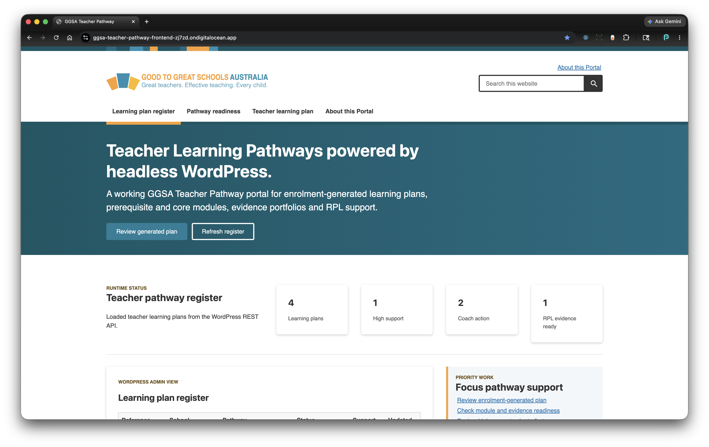
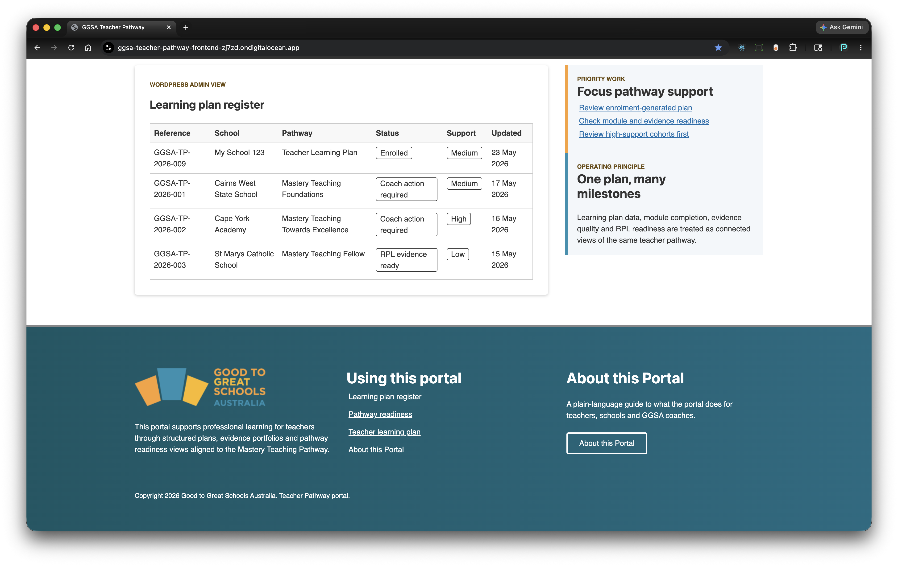
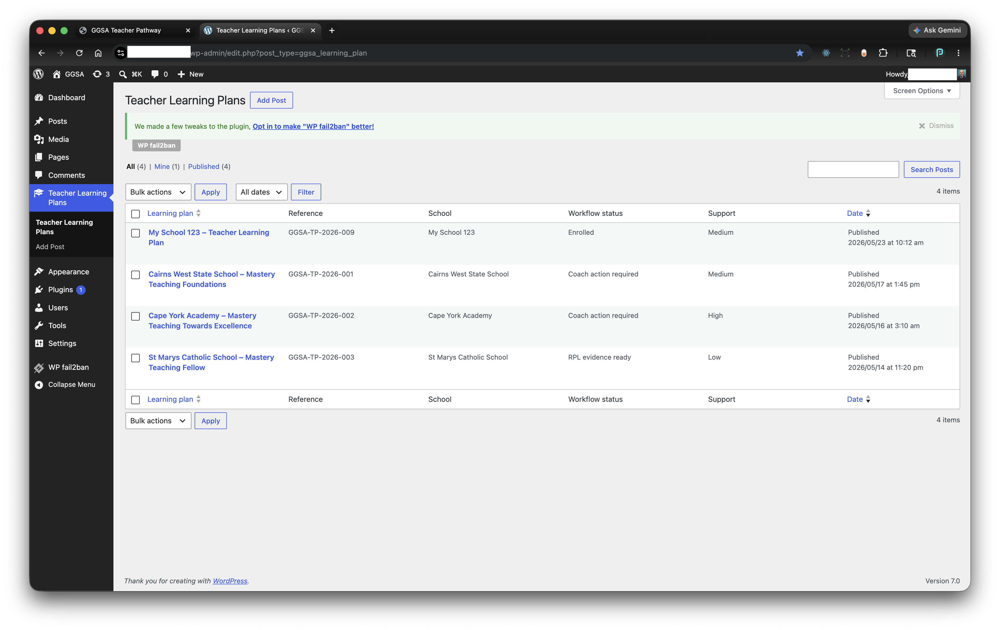
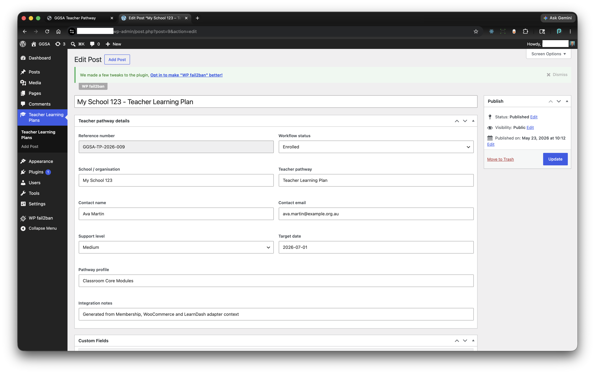

# GGSA Teacher Pathway Portal

Working prototype of a Teacher Pathway portal for Good to Great Schools Australia.

The prototype shows a decoupled Next.js frontend, a custom headless WordPress plugin, adapter-ready boundaries for LearnDash/WooCommerce/membership concepts, evidence upload, readiness review, WordPress admin visibility and local/CI validation.

## Live Demo

Current DigitalOcean review environment:

- Frontend portal: https://ggsa-teacher-pathway-frontend-zj7zd.ondigitalocean.app
- Backend WordPress REST base: shared privately with reviewers
- Backend WordPress admin: shared privately with authorized reviewers only

The DigitalOcean deployment is a prototype review environment, not GGSA production infrastructure. The frontend runs on DigitalOcean App Platform from `frontend/Dockerfile`; the backend runs on a DigitalOcean WordPress Droplet with the `ggsa-teacher-pathway` plugin installed and activated.

## Screenshots

| Frontend home, top | Frontend home, footer |
| --- | --- |
|  |  |

| Backend learning plan list | Backend learning plan item |
| --- | --- |
|  |  |

## What Is Real

- Next.js App Router portal with register, readiness, learning-plan and about views.
- Same-origin Next.js API routes over WordPress REST.
- Custom WordPress plugin with:
  - `ggsa_learning_plan` custom post type;
  - secured REST routes;
  - learning plan creation/listing/readiness/evidence endpoints;
  - redacted admin visibility for submitted plans;
  - Divi-friendly portal launch shortcode.
- Local PHP/SQLite WordPress runtime for fast real-backend E2E.
- Docker Compose runtime for full-stack parity.
- Playwright accessibility, contrast, keyboard and workflow coverage.
- PHP syntax, PHPCS, PHPStan and REST contract tests.

## What Is Simulated

- LearnDash course/module/progress data is adapter-backed local fallback data.
- WooCommerce entitlement data is adapter-backed local fallback data.
- Membership/teacher-role enrolment data is adapter-backed local fallback data.
- Evidence upload policy is real prototype validation, but production storage, malware scanning, retention and privacy rules still need GGSA decisions.

## Tech Stack

- Frontend: Next.js 15, React 18, TypeScript, Sass, Playwright, Vitest.
- Backend: WordPress, PHP 8.3, custom REST plugin, custom post type.
- Runtime: local PHP/SQLite for fast FE+BE checks, Docker Compose with WordPress/MariaDB for parity.
- Tooling: pnpm 10.18.3, Node 20.19.x, Composer, GitHub Actions.

## Run Locally

Install the pinned frontend toolchain:

```bash
volta install node@20.19.5 pnpm@10.18.3
export PATH="$HOME/.volta/bin:$PATH"
pnpm --dir frontend install
composer --working-dir=backend/wp-content/plugins/ggsa-teacher-pathway install
```

Fast local real-backend path, no Docker:

```bash
pnpm backend:setup:local
pnpm test:e2e:local:real
```

Full Docker path:

```bash
pnpm docker:build
pnpm docker:up:seed
```

Local URLs:

- Frontend: `http://localhost:5173`
- WordPress: `http://localhost:8080`
- WordPress admin: `http://localhost:8080/wp-admin` with `admin` / `admin`

## Main Checks

```bash
pnpm format:check
pnpm lint
pnpm typecheck
pnpm test
pnpm php:quality
pnpm test:e2e
pnpm test:e2e:local:real
```

Grouped shortcuts:

```bash
pnpm ci:quick
pnpm ci:real
pnpm ci:docker
```

## Key Docs

- [Architecture overview](docs/architecture-overview.md)
- [Integration alignment](docs/integration-alignment.md)
- [Divi deployment strategy](docs/divi-deployment-strategy.md)
- [CI/CD](docs/ci-cd.md)
- [DigitalOcean deployment](docs/digitalocean-deployment.md)
- [Implementation summary](docs/technical-implementation-stages.tmp.md)

## DigitalOcean Deployment Summary

The current review deployment uses:

- `syd1` Droplet region for the WordPress backend, closest to GGSA's Cairns/Australia context.
- DigitalOcean App Platform region `syd` for the frontend.
- GitHub-connected App Platform deploys from the `main` branch.
- Runtime environment variables generated from `.do/app.template.yml`; `.do/app.generated.yml` and `.env.local` stay untracked because they contain environment-specific values.

Typical frontend deployment flow:

```bash
set -a
source .env.local
set +a

perl \
  -e 'local $/; $_=<>; s/__WORDPRESS_API_BASE_URL__/$ENV{WORDPRESS_API_BASE_URL}/g; s/__GGSA_TEACHER_PATHWAY_API_TOKEN__/$ENV{GGSA_TEACHER_PATHWAY_API_TOKEN}/g; s/__NEXT_TELEMETRY_DISABLED__/$ENV{NEXT_TELEMETRY_DISABLED}/g; print' \
  .do/app.template.yml > .do/app.generated.yml

doctl apps create --spec .do/app.generated.yml
```

After the app exists, use this to force a fresh production rebuild:

```bash
doctl apps create-deployment <app-id> --force-rebuild
```

## Production Next Steps

- Replace local shared API token with production authentication and role-aware authorization.
- Connect adapters to real LearnDash, WooCommerce and membership systems.
- Decide evidence storage, malware scanning, privacy and retention rules.
- Confirm whether GraphQL/Hasura is required for reporting.
- Use the Divi shortcode launch-card path first, preferably pointing to a dedicated portal subdomain.
